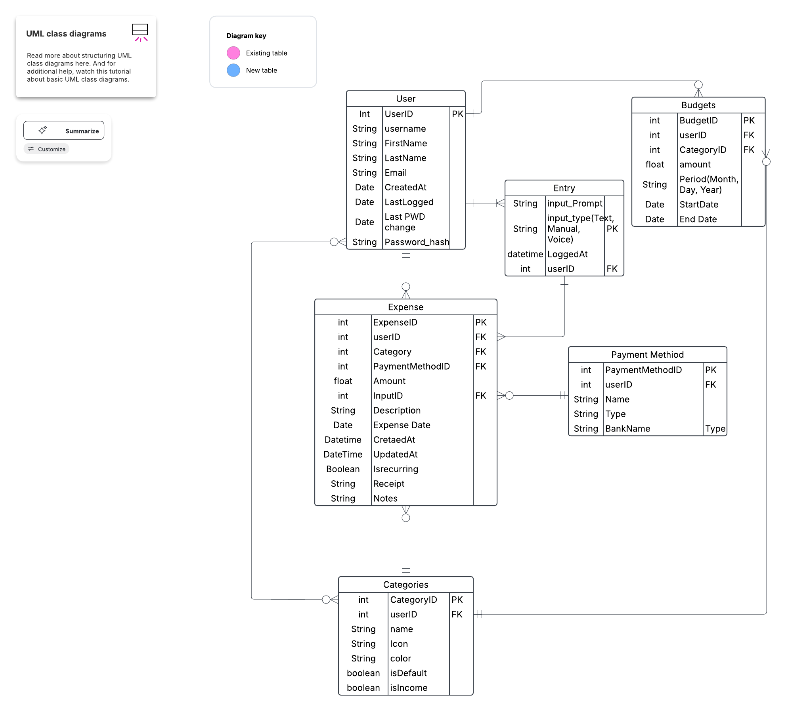

# Finance Tracker Backend

The **Finance Tracker Backend** is a robust Node.js-based RESTful API designed to manage personal finance data. It provides features for tracking expenses, managing categories, handling payment methods, and more. The backend is built with PostgreSQL as the database and Sequelize as the ORM, ensuring scalability and performance.

---

## **Features**
- **User Authentication**: Secure login and registration using JWT.
- **Expense Management**: Add, update, delete, and retrieve expenses.
- **Category Management**: Organize expenses into categories.
- **Payment Methods**: Manage payment methods like credit cards, cash, etc.
- **Recurring Expenses**: Track recurring transactions.
- **Receipt Handling**: Upload and process receipts.
- **Vector Embeddings**: Advanced data processing using `pgvector` for similarity searches.

---

## **Entity Relationship Diagram (ERD)**

Below is the ERD diagram for the database schema:



---

## **Tech Stack**
- **Node.js**: Backend runtime.
- **Express.js**: Web framework for building RESTful APIs.
- **PostgreSQL**: Relational database for storing data.
- **Sequelize**: ORM for database interaction.
- **pgvector**: PostgreSQL extension for vector similarity search.
- **Jest**: Testing framework for unit and integration tests.
- **dotenv**: Environment variable management.

---

## **Folder Structure**
```
Ftracker_backend/
├── babel.config.js
├── FinanceTracker.png
├── jest.config.js
├── package.json
├── README.md
├── src/
│   ├── config/          # Database and environment configurations
│   ├── controllers/     # API controllers for handling requests
│   ├── middleware/      # Authentication and validation middleware
│   ├── models/          # Sequelize models for database tables
│   ├── routes/          # API route definitions
│   ├── services/        # Business logic and external integrations
│   ├── utils/           # Utility functions (e.g., email, validators)
│   ├── __tests__/       # Unit and integration tests
│   ├── server.js        # Entry point for the backend server
│   └── mcp-server.js    # MCP server setup
├── uploads/             # Folder for storing uploaded files (e.g., receipts)
└── database/            # SQL scripts for database setup
```

---

## **Setup Instructions**

### **Prerequisites**
- Node.js (v16 or higher)
- PostgreSQL (v12 or higher)
- `pgvector` extension installed in PostgreSQL

### **Installation**
1. Clone the repository:
   ```bash
   git clone https://github.com/your-repo/finance-tracker-backend.git
   cd Ftracker_backend
   ```

2. Install dependencies:
   ```bash
   npm install
   ```

3. Create a `.env` file in the root directory and configure the following variables:
   ```
   DB_HOST=127.0.0.1
   DB_PORT=5432
   DB_USER=your_postgres_user
   DB_PASSWORD=your_postgres_password
   DB_NAME=finance_tracker
   PORT=8000
   IP_ADDRESS=127.0.0.1
   ```

4. Ensure the `pgvector` extension is installed in your PostgreSQL database:
   ```sql
   CREATE EXTENSION IF NOT EXISTS vector;
   ```

5. Run database migrations and seed data (if applicable):
   ```bash
   npm run migrate
   ```

---

## **Running the Server**

### **Development Mode**
Start the server in development mode:
```bash
npm run dev
```
This will start the server with live reloading using `nodemon`.

### **Production Mode**
Start the server in production mode:
```bash
npm start
```

---

## **API Endpoints**

### **Authentication**
- `POST /api/auth/login`: User login.
- `POST /api/auth/register`: User registration.

### **Categories**
- `GET /api/categories`: Get all categories.
- `POST /api/categories`: Create a new category.
- `PUT /api/categories/:id`: Update a category.
- `DELETE /api/categories/:id`: Delete a category.

### **Expenses**
- `GET /api/expenses`: Get all expenses.
- `POST /api/expenses`: Create a new expense.
- `PUT /api/expenses/:id`: Update an expense.
- `DELETE /api/expenses/:id`: Delete an expense.

### **Payment Methods**
- `GET /api/payment-methods`: Get all payment methods.
- `POST /api/payment-methods`: Add a new payment method.
- `PUT /api/payment-methods/:id`: Update a payment method.
- `DELETE /api/payment-methods/:id`: Delete a payment method.

---

## **Testing**
Run unit and integration tests using Jest:
```bash
npm test
```

---

## **Error Handling**
The backend uses centralized error-handling middleware to catch and respond to errors consistently. Errors are logged to the console for debugging.

---

## **Contributing**
1. Fork the repository.
2. Create a new branch:
   ```bash
   git checkout -b feature-name
   ```
3. Commit your changes:
   ```bash
   git commit -m "Add feature description"
   ```
4. Push to the branch:
   ```bash
   git push origin feature-name
   ```
5. Open a pull request.


---
